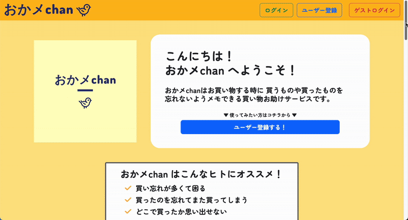
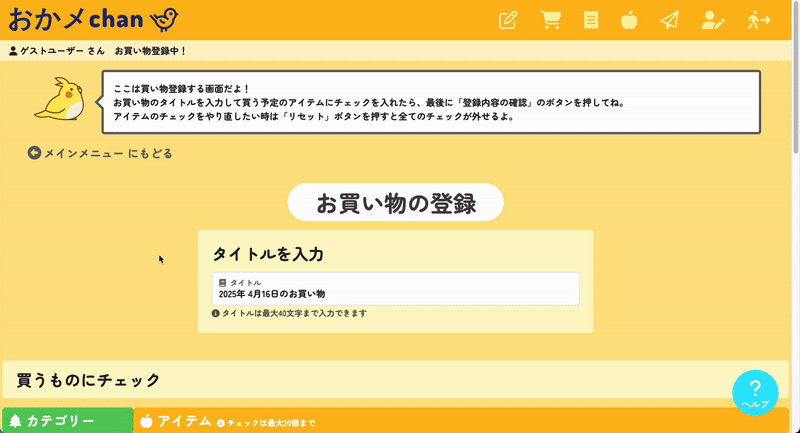
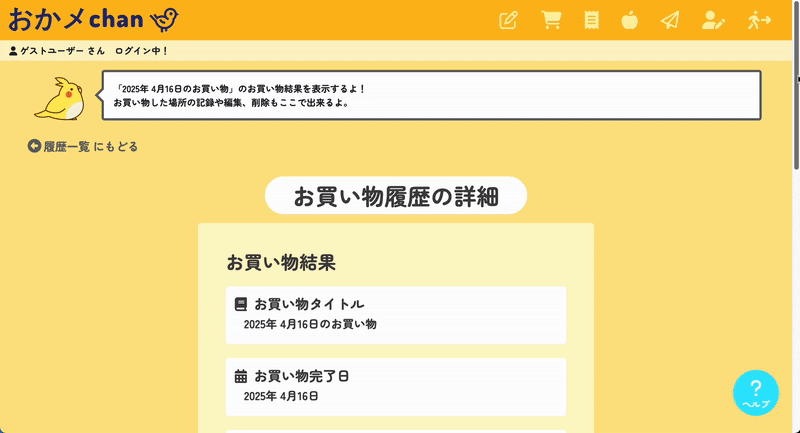
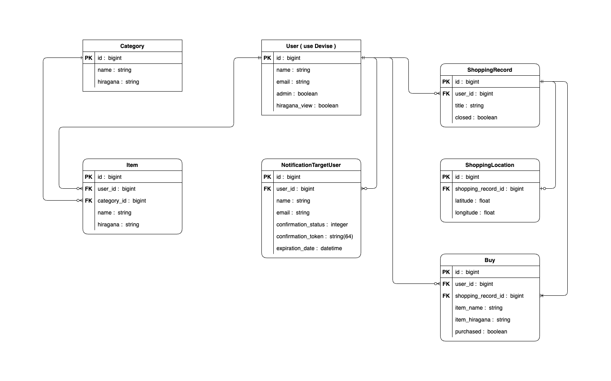
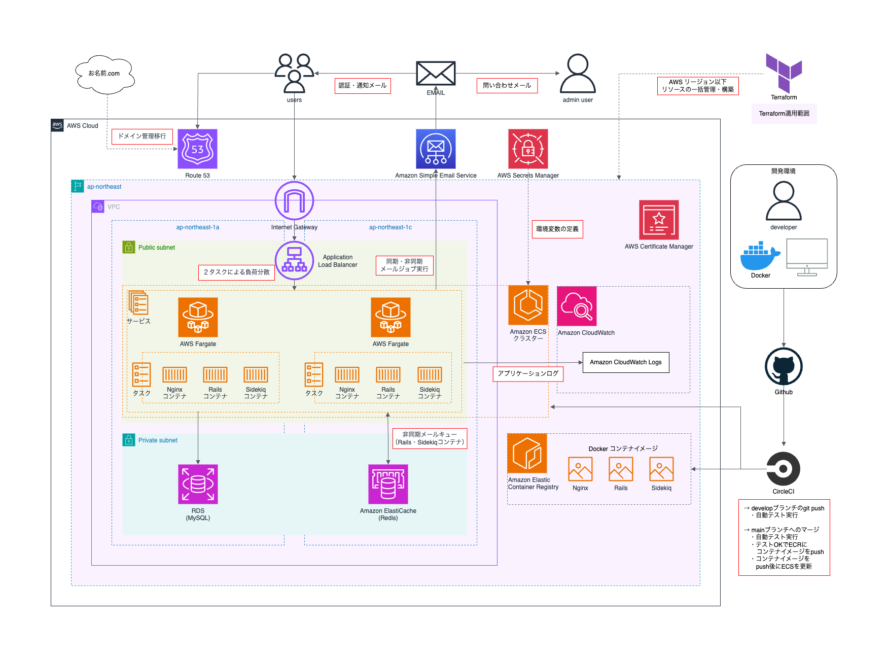

# おかメchan

## 概要
**おかメchan** は、お買い物サポート Web アプリケーションです。  
買い物リストの作成や、リストを基にした買い物結果の保存・メール通知、買い物履歴の管理機能を実装しています。


## スクリーンショット
- トップ画面

- お買い物登録画面

- お買い物モード画面（スマートフォンでの操作を想定）

- お買い物履歴画面



## ER図



## アーキテクチャ図



## デモ
本アプリはこちらから利用できます:
**https://okamemo.com**

> 本番環境のため、実際にデータが保存されます。
> お試し版として **「ゲストログイン」** から制限付きで各機能を利用できます。
> - お買い物・アイテムの登録件数に制限あり
> - ユーザー情報の一部編集不可
> - 問い合わせフォームへの投稿不可
>
> **※ 管理者機能（管理用ダッシュボード）は本番環境では非公開です。**
> **管理者機能を確認したい場合は、ローカル環境をセットアップのうえ、管理ユーザーでログインしてください。**


## 主な機能
- お買い物の管理（**登録・編集・削除**）
- お買い物記録の保存・履歴の参照
- お買い物場所の管理（**Google Maps API** を利用した位置情報管理）
- ユーザーの管理（**登録・編集・削除・認証**、`Devise` を使用）
- 通知対象ユーザーの管理（**登録・削除・認証**）
- アイテムの管理（**登録・編集・削除**）
- 管理者への問い合わせフォーム
- メール通知機能（`AWS SES` を使用）
- 非同期処理（`Sidekiq` + `Redis`）
- 一覧画面のリスト表示（`Pagy` によるページネーション対応）
- `reCAPTCHA` によるスパム対策
- 管理者用ダッシュボード


## 想定する利用シーン
本アプリは、以下のようなシーンでの利用を想定しています。
- 買い物リストを紙ではなくPC・スマホで管理したい方
- 高齢者を介護・サポートしているご家族
- 小さいお子さんに買い物を任せているご家族
- 離れた家族に買い物内容を共有したいケース


## 使用技術
### フロントエンド
- `HTML` / `CSS` / `JavaScript`
- `Bootstrap 5`
- `gon`（Rails → JavaScript のデータ受け渡し）
- `Google Maps API`（位置情報の表示）

### バックエンド
- `Ruby 3.2.2`
- `Ruby on Rails 7.0.6`
- `MySQL 8.0.33`
- `Redis`（ElastiCache）
- `Sidekiq`（非同期処理）
- `Google reCAPTCHA`（スパム対策）
- `Devise`（ユーザー認証）
- `Pagy`（ページネーション）
- `hashid-rails`（IDの難読化）
- `ransack`（検索機能）

### インフラ
- `AWS Fargate`（Rails、Nginx、Sidekiq）
- `AWS RDS`（MySQL）
- `AWS ElastiCache`（Redis）
- `AWS Route 53`（ドメイン管理）
- `AWS SES`（メール送信）
- `AWS Secrets Manager`（環境変数管理）
- `AWS Certificate Manager`（SSL証明書管理）
- `Terraform`（インフラのコード化・構成管理）
- `Nginx`（Web サーバー兼リバースプロキシ）
- `Docker`（コンテナ化）
- `docker-compose`（開発・CI環境の構築）

### CI/CD
- `CircleCI` を使用
  - `develop` ブランチのプッシュ時に `RSpec` と `RuboCop` のテストを実行
  - `main` ブランチへのマージでテスト後に `ECR` に Docker イメージをプッシュし、`ECS` のクラスター・サービス・タスクを更新してデプロイ

### テスト
- `RSpec` を使用した各種テスト：
  - モデルスペック（CRUD、メソッド、バリデーション、関連など）
  - メーラースペック（各種メールの内容検証）
  - ヘルパースペック（各種 `helper` メソッドの挙動検証）
  - クラス単体のスペック（`AdminConstraint` の挙動検証）
  - システムスペック（ユーザー操作を再現したエンドツーエンドテスト）
- `selenium-webdriver`（JavaScript を伴うシステムスペック）
> **補足：** システムスペックで使用する `selenium-webdriver`（バージョン: 4.27.0）と、
> 開発・CI環境のSeleniumコンテナ（`selenium/standalone-chromium:131.0` / `selenium/standalone-chrome:131.0`）の
> **Chromeバージョンを一致させることで、バージョン差異による動作不具合のリスクを最小限に抑えています。**
- `RuboCop`（Airbnb スタイルガイド準拠）
  - `rubocop-airbnb` をベースに `.rubocop.yml` にて一部設定を変更（例：行の最大長130文字、`Airbnb/OptArgParameters` 無効化 など）


## 技術的チャレンジ・工夫した点
- **クリック・タップのみでメインの機能を利用できる簡単操作**  
  メインとなるお買い物関連の機能をほぼクリック・タップだけで簡単に操作可能なUIとすることで、子どもや年配ユーザーでも直感的に使えるようにしました。
- **ハンディキャップを持つ親をサポートする目的で開発**  
  家族の事情を踏まえ、「実際に使える」ことを意識した画面設計とフロー構築を心掛けました。
- **レスポンス向上を意識した技術選定**  
  Rails 7 の Turbo による部分更新と、軽量な Pagy によるページネーションで、描画速度とユーザー体験を向上させました。  
  また、Nginx をWebサーバーとして採用し、静的ファイル配信やリバースプロキシによる処理の高速化も図っています。
- **AWS環境での本番運用を想定した構築**  
  Secrets Manager による安全な環境変数管理や、ECR・ECS・Fargate を用いた CI/CD の自動化を行いました。  
  スケーラビリティや保守性を考慮した、実際の本番運用を見据えたインフラ設計を学ぶことができました。
- **Terraformによるインフラの視覚化および一括管理・構築**  
  AWSインフラ構成を Terraform でコード化・視覚化し、ドキュメントとしても管理できるようになりました。  
  本番環境のリソースの構築・廃止を一括で行えるようにして、運用の属人化防止とセットアップ作業の手間・ミスの削減を図りました。
- **非同期処理によるメール送信**  
  メール送信回数の多い場面（通知ユーザー登録時や通知機能のメール一斉送信など）の処理を非同期化することで、ユーザー体験の向上とレスポンス高速化を図りました。
- **Seleniumコンテナを使用したJavaScript付きのE2Eテスト**  
  Docker 環境下で Selenium コンテナ + headless Chrome を用いることで、アプリコンテナに Chrome をインストールせずに JavaScript 含む E2Eテストを実現し、リソースの削減に成功しました。  
- **モックによるAPIに依存しないテスト**  
  Google Maps API や Geolocation 、ReCAPTCHAを モック化することで、外部APIに依存せず、精度の高いテストを実現しました。
- **フォームオブジェクトによる複数テーブルへの一括データ保存**  
  買い物データと、それに紐づく複数の購入記録を一度に登録できるよう、フォームオブジェクトを導入しました。  
  複雑な内部データ構造に対して、整合性のある保存処理を行うための実践的なアプローチを学ぶことができました。
- **セキュリティを重視した設計**  
  「今の自分にできる限り」のセキュリティ対策を意識して、予期しない入力やアクセスに対しても堅牢な挙動を保てるよう心掛けました。
  - オーナーシップ制御やスコープベース・ロールベースのアクセス制御を積極的に導入し、ユーザーのデータを保護。
  - `hashid-rails` による ID の難読化で、不正アクセスや URL 直打ちリスクを軽減。
  - デベロッパーツール等による不正リクエストに備え、モデル・コントローラーで入力検証とリダイレクト処理を実装。
  - `AdminConstraint` によるルーティング分岐で、管理画面は一般ユーザーには見えないよう設計。
- **将来の自分への教科書となるような設計と実装**  
  本アプリは、今後自分が開発に取り組む際の指針となるよう、基本的な実装方針だけでなく、本セクションで紹介した実践的な工夫やアプローチを組み込みました。


## 開発環境
- Apple M1 チップ搭載の macOS 上で `Docker` を使用して開発
- `docker-compose` により以下のコンテナを構成：
  - `app`：アプリケーション本体（Rails 7.0.6 + Ruby 3.2.2）  
    使用イメージ：`ruby:3.2.2-bullseye`
  - `db`：データベース（MySQL 8.0.33）  
    使用イメージ：`mysql:8.0.33`
  - `redis`：キャッシュ・ジョブ管理用（Redis）  
    使用イメージ：`redis:bullseye`
  - `sidekiq`：バックグラウンドジョブ実行  
    使用イメージ：`app` イメージと共通
  - `nginx`：Web サーバー兼リバースプロキシ  
    使用イメージ：`nginx:mainline-bullseye`
  - `selenium_chrome`：JavaScript対応のシステムスペック用（headless Chrome）  
    使用イメージ：`selenium/standalone-chromium:131.0`
- JavaScript を伴うシステムスペックは、Selenium コンテナ（headless Chrome）上で実行
- `RuboCop`（`rubocop-airbnb`）によりコード品質をチェック
- `GitHub` と連携し、`CircleCI` による自動テスト・デプロイを実施

> **補足：** 開発用コンテナのうち `app`、`redis`、`nginx` には **Debian bullseye ベースの公式イメージ** を統一して使用し、開発中のトラブルを最小限に抑える構成にしています。
> 本番環境（AWS Fargate）でも、`app` と `nginx` のコンテナには同様に bullseye ベースのイメージを使用しており、開発・本番間の環境差異を極力なくしています。


## ローカル環境セットアップ手順
### 必要要件（事前にご準備ください）
- Docker / Docker Compose
- Git
- 任意のエディタ（例: VSCode）

### 1. リポジトリをクローン
```bash
git clone https://github.com/Soylent-sys/okamemo_app.git
cd okamemo_app
```

### 2. .env の作成
.env.sample をコピーして .env ファイルを作成し、各値を環境に合わせて入力してください。

```bash
cp .env.sample .env
```

.env には以下の環境変数を設定します:

```dotenv
# SESを使用するための認証情報
SES_AWS_ACCESS_KEY_ID=（SESのアクセスキー）
SES_AWS_SECRET_ACCESS_KEY=（SESのシークレットキー）

# hashid-rails用のソルト
HASHID_SALT_CHAR=（任意のハッシュソルト）

# マスター管理ユーザーのログイン情報
ADMIN_USER_EMAIL=（任意のメールアドレス）
ADMIN_USER_PASSWORD=（英数字含む8文字以上）

# Google Maps API
GOOGLE_MAP_API_KEY=（Google MapsのAPIキー）

# お問い合わせの送信先
CONTACT_EMAIL=（任意のメールアドレス）

# reCAPTCHAの設定
RECAPTCHA_SITE_KEY=（reCAPTCHAサイトキー）
RECAPTCHA_SECRET_KEY=（reCAPTCHAシークレットキー）
```

> ※ これらのキーやトークンは、必要に応じて無料枠で取得可能なサービスもあります。  
> ※ SESやreCAPTCHA、Google Maps APIのキーは未設定でも一部画面は動作しますが、正しく動作させるには設定が必要です。  
> ※ 管理者機能にアクセスする場合は .env で指定した ADMIN_USER_EMAIL / ADMIN_USER_PASSWORD を使用してログインしてください。  
>
> **注意：** 管理者機能は一般ユーザー向けの機能ではなく、運用・保守目的で設計されています。
> 誤操作によるデータ変更やそれに伴う不具合にご注意ください。

### 3. Dockerコンテナの起動
Docker イメージをビルドして起動します:
```bash
docker-compose build
docker-compose up -d
```

### 4. DBのセットアップ
```bash
docker-compose exec app rails db:setup
```

### 5. アプリにアクセス
ブラウザで以下のURLにアクセスしてください：
http://localhost:3000


## 今後の改善点
- 買い物モード中に買い物リストを編集できる機能の追加
- 買い物登録→買い物モードの完了まで一気通貫で実施できる機能の追加
- 購入アイテム名から買い物履歴を検索する機能の追加
- ナビゲーションの吹き出しを開閉できるよう対応
